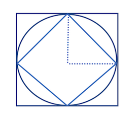

# Problem Set I


```python
%%HTML
<iframe width="560" height="315" src="https://www.youtube.com/embed/HktA7HH5NBc" frameborder="0" allow="autoplay; encrypted-media" allowfullscreen></iframe>
```


<iframe width="560" height="315" src="https://www.youtube.com/embed/HktA7HH5NBc" frameborder="0" allow="autoplay; encrypted-media" allowfullscreen></iframe>


**Mathematical Goals**:

- Solve problems related to areas 
- Solve area approximation problems using Riemann sums
- Perform basic operations on numbers including root extraction
- Use Pythagorean Theorem to find distances


### Guidelines for writing Solutions 

Please be aware that your solutions are a letter of sorts, meant for a reader who is interested in your solutions to a problem that they have posed to you.  Clearly write a solution response that walks through your method and results.  Use multiple representations including **words**, **symbols**, **pictures**, and **tables**.


**Suggested Reading**:

- Chapter 1: *The Historical Development of Calculus*, C.H.Edwards
- Chapter 1: *The Origins of Calculus*, David Perkins

If you read these, I suggest that first, you simply relax and cruise through the reading one time; don't slow down when it gets technical.  Then, go back to the mathematical arguments and pay closer attention to the details of the argument after you understand the big picture of the concepts being introduced.  Here, we are primarily struggling with the notion of what is a number and how do we use these to represent areas of 2D regions.

### Problem I

The Babylonians generally used $3r^2$ for the area of a circle of radius $r$, corresponding to the poor approximation $\pi \approx 3$.  Show that this approxiamation could have been obtained by averaging the areas of the iscribed and circumscribed squares shown below.



### Problem II

Archimedes took a similar approach to approximating $\pi$.  He began by inscribing and circumscribing a circle with regular hexagons, and successively doubled the sides in order to, calculuating their perimeters to find upper and lower bounds for $\pi$.  Beginning with a circle of radius 1 and compute the perimeter for the following shapes:

| Polygon | Area |
| ------- | --------- |
| Inscribed 6 sided |    |
| Circumscribed 6 sided |    |
| In 12 Sided   |      |
| Circum 12 Sided  |     |

### Problem III

The Babylonians approached square root approximation in a similar iterative methodology like Archimedes use of the method of exhaustion.  To start, suppose we have a guess that we think is close to $\sqrt{2}$

$$x_1 \approx \sqrt{2} \quad \rightarrow \quad x_1 \times x_1 \approx 2 \quad \rightarrow \quad x_1 \approx \frac{2}{x_1}$$

Either $x_1$ is a better guess or $\frac{2}{x}$, but even better still would be the average of the two:

$$x_2 = \frac{1}{2} \big(x_1 + \frac{2}{x_1}\big)$$

If we continue in this manner we will get better and better approximations:

$$x_3 = \frac{1}{2} \big(x_2 + \frac{2}{x_2}\big)$$

$$x_4 = \frac{1}{2} \big(x_3 + \frac{2}{x_3}\big)$$

$$x_5 = \frac{1}{2} \big(x_4 + \frac{2}{x_4}\big)$$

$$\vdots$$

$$x_{n+1} = \frac{1}{2} \big(x_n + \frac{2}{x_n}\big)$$

Follow the Babylonians method to approximate $\sqrt{3}$ through $x_5$.  As a bonus, try a few different starting guesses and see how different they are by the fifth iteration.  

### Problem IV

Al - Khowarizimi also discussed an approach to solving quadratic equations such as $x^2 + 10x = 39$.  According to Edwards, his solution was

- Take half the number of roots, that is, five, and multply this by itself to obtain twenty-five.  
- Add this to the thiry-nine, giving sixty-four.  
- Take the square root, or eight, and subtract from it half the number of roots (five).
- The result, 3, is the required root.


Solve the equation $x^2 + 8x = 65$ following a similar construction to that above.

### Problem V

The images below help to understand the value of expressions like:

$$ 1 + 2 + 3 + 4 + ... + (n-1) + n = $$


1. Find the sum when $n = 5$
2. Find the sum when $n = 10$
3. Is there a way to use the image below to understand the sum when $n = 100$?


### Problem VI

Approximate the area under the graph of $f(x) = x^2$, from $x = 1$ to $x = 5$ using the follow schemes (feel free to use the table to organize your thoughts):

- 4 rectangles erected on the right endpoint of each subinterval

| Rectangle # | left endpoint | right endpoint | width | height | area |         
| ---------- | -------------- | -------------  | ------ | ------- | -------- |
|         
|
|
|


- 8 rectangles erected on the right endpoint of each subinterval


### Plot Code

Here's how I made the plot.


```python
%matplotlib inline
import matplotlib.pyplot as plt
import numpy as np
```


```python
x = np.linspace(0,5, 1000)
y = x**2
plt.figure(figsize = (9, 5))
plt.plot(x, y, label = '$f(x) = x^2$')
plt.fill_between(x, y, where=x>1, alpha = 0.3)
plt.step([i for i in range(6)],[i**2 for i in range(6)] )
plt.step([i for i in range(6)],[i**2 for i in range(6)], where = 'post')
plt.legend(frameon = False)
plt.title('Two Possible Approaches', loc = 'left')
plt.savefig('images/riemann_h1.png')
```


